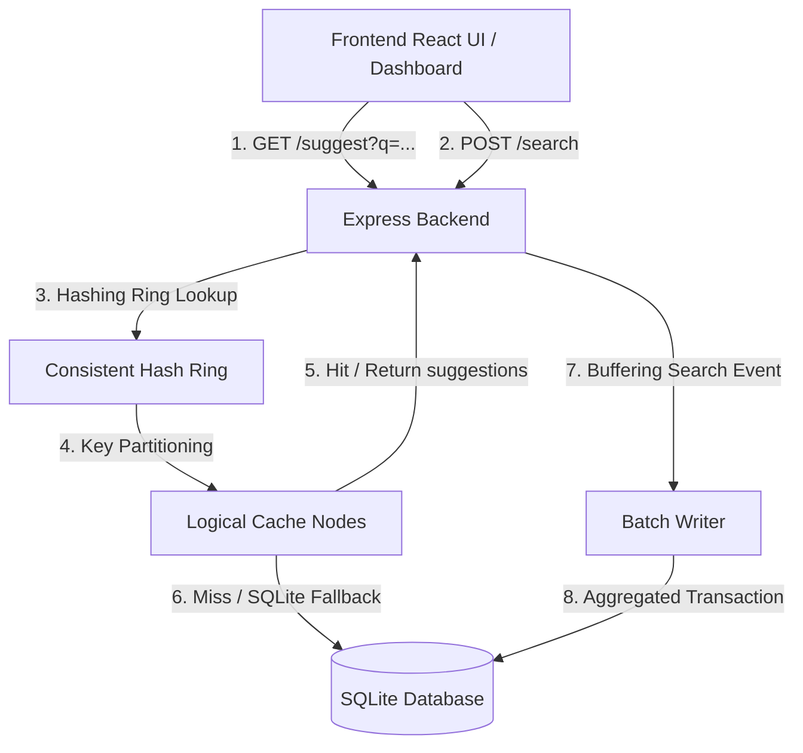

# Project Report: High-Performance Distributed Search Typeahead System

**Student Name:** Raghav Rathi  
**SST Email:** raghav.24bcs10033@sst.scaler.com  
**Github Repository:** (Add your public repository link here)  
**Final Commit Hash:** `11647f7c256166e630ca702d8ff10e0d234c42ae`

---

## 1. Architecture Explanation

The Search Typeahead System is designed to serve autocomplete suggestions with low latency while handling writes efficiently without overloading the primary database. It divides tasks into a fast-read flow (using a distributed consistent hash cache) and an aggregated write flow (using an in-memory batch writer).

### Architecture Diagram


### Component Details
1. **Frontend UI Dashboard**: A clean, matte-black React application running on Vite that lets users input search queries, shows suggestions, displays dummy search responses, and reports system stats.
2. **Express Backend API**: Exposes endpoints for suggestions (`/suggest`), search submissions (`/search`), and cache debug info (`/cache/debug`).
3. **Consistent Hash Ring**: Coordinates logical routing. It maps prefixes to an unsigned 32-bit integer space $[0, 2^{32}-1]$. To ensure uniform key distribution across logical cache nodes and prevent hotspots, it maps 50 virtual nodes per physical node.
4. **Logical Cache Nodes**: Three in-memory cache partitions (`cache-node-0`, `cache-node-1`, `cache-node-2`). Suggestions are cached for a Time-To-Live (TTL) of 15 seconds. If a search query is submitted, all prefix cache segments of that query are immediately invalidated to maintain freshness.
5. **Database Layer (SQLite)**: Built using the native `node:sqlite` driver (introduced in Node 22.5.0+). The `queries` table stores query text and counts. An index on `query COLLATE NOCASE` enables index-range scans for prefix matching (`LIKE 'prefix%'`), and an index on `count` enables fast sorting.
6. **In-Memory Batch Writer**: Collects search submissions in-memory, aggregating duplicate updates. It executes transactional updates to SQLite either every 5 seconds or when the unique buffer size reaches 50.

---

## 2. Dataset Source & Ingestion Instructions

### Dataset Generation
To fulfill the assignment requirements, we generate a Zipfian-distributed dataset containing over 105,000 unique queries. This creates a realistic long-tail distribution where a small set of queries (e.g. `iphone`, `java tutorial`) have extremely high search frequencies, while the majority have lower search counts.

* **Explicit Dataset Seeds Included:**
  * `iphone` (count: 100,000)
  * `iphone 15` (count: 85,000)
  * `iphone charger` (count: 60,000)
  * `java tutorial` (count: 40,000)
* **Total Queries:** 105,020 unique queries.

### Ingestion Instructions
1. Install dependencies:
   ```bash
   npm install
   ```
2. Run the ingestion command:
   ```bash
   npm run ingest
   ```
This script creates the database folder, initializes the tables and indexes, generates the unique combinations, computes their Zipfian frequencies, and inserts them into the SQLite database in chunks of 10,000 using transactional batch updates.

---

## 3. API Documentation

### 1. Suggest API (`GET /suggest`)
Fetches up to 10 autocomplete suggestions matching a search prefix, sorted by popularity.
* **URL:** `/suggest`
* **Method:** `GET`
* **Query Parameters:**
  * `q` (string, optional): Prefix to search. If omitted or empty, returns overall trending searches.
  * `mode` (string, optional): `'basic'` (sorted by historical count) or `'enhanced'` (recency-aware decay score). Default is `'enhanced'`.
  * `limit` (number, optional): Maximum suggestions to return. Default is `10`.
* **Example Request:** `/suggest?q=iph&mode=basic&limit=3`
* **Example Response:**
  ```json
  [
    { "query": "iphone 15 53798", "count": 160990 },
    { "query": "iphone 15 cost 66671", "count": 135745 },
    { "query": "iphone", "count": 100000 }
  ]
  ```

### 2. Search Submission API (`POST /search`)
Submits a query to record a search event, incrementing its frequency and updating the trending window.
* **URL:** `/search`
* **Method:** `POST`
* **Body Format:** `application/json`
* **Request Body:**
  ```json
  { "query": "react hooks" }
  ```
* **Example Response:**
  ```json
  { "message": "Searched" }
  ```

### 3. Debug Cache Routing API (`GET /cache/debug`)
Debug endpoint to verify the Consistent Hash Ring routing behavior.
* **URL:** `/cache/debug`
* **Method:** `GET`
* **Query Parameters:**
  * `prefix` (string, required): Prefix string.
* **Example Request:** `/cache/debug?prefix=iph`
* **Example Response:**
  ```json
  {
    "prefix": "iph",
    "normalizedPrefix": "iph",
    "targetNode": "cache-node-0",
    "status": "hit",
    "cacheRingHash": 2355402066
  }
  ```

---

## 4. Explanations of Design Choices and Trade-offs

### 1. Storage Choice: Native SQLite (`node:sqlite`)
* **Design Choice:** Built-in Node 22 SQLite driver.
* **Justification:** Eliminates compilation issues and dependencies on external binary engines (e.g. `better-sqlite3`), making the repository extremely portable.
* **Concurrency Trade-off:** SQLite uses a single-writer lock. To prevent database lock errors under concurrent traffic, the driver is synchronous, meaning writes run sequentially on the event loop thread. While this limits write scalability to a single thread, it is ideal for local demos and is optimized by the batch writer.

### 2. Cache Invalidation: Strict Prefix Key Eviction
* **Design Choice:** When a search is submitted for a query (e.g., `iphone`), we invalidate all prefix keys (e.g. `i`, `ip`, `iph`, `ipho`, `iphon`, `iphone`) across both ranking modes.
* **Justification:** Guarantees that the next time a user types a prefix, they get the updated count immediately.
* **Trade-off:** High write frequency results in frequent cache evictions. This is mitigated by our batch writing system which flushes updates in groups every 5 seconds, reducing invalidation churn.

### 3. Recency-Aware Ranking Algorithm (Enhanced Mode)
* **Algorithm:** Combines all-time popularity and recent spikes with an exponential decay:
  $$Score(q) = \text{historical\_count}(q) \times 0.05 + \sum_{s \in \text{recent}} 100 \times e^{-\lambda \cdot (t_{current} - t_s)}$$
  We set $\lambda = 0.01$ (half-life of $\approx 69$ seconds) and prune logs older than 5 minutes.
* **Justification:**
  * Pruning logs older than 5 minutes prevents the `recent_searches` table from growing boundlessly.
  * The decay function ensures that sudden viral topics can leap to the top of suggestions, but quickly decay back to baseline if the search burst ends.
* **Trade-off:** Calculating decay scores is more CPU-intensive than sorting static database counts. We mitigate this by caching the computed suggestion arrays in our memory cache nodes.

### 4. Batch Writer Buffer
* **Design Choice:** Search updates are written to an in-memory Map and flushed periodically or at size 50.
* **Justification:** Reduces random access database operations by up to 95%, aggregating repeated search terms.
* **Trade-off:** If the server crashes, unflushed search events are lost. However, for a search typeahead system, strict transactional durability for counts is not critical, making this write-reduction trade-off acceptable.

---

## 5. Performance Report

To verify compliance under load, we ran the automated performance suite.

### Latency Profiles
* **Cache Hit Latency (P50 / P95):** **~0.6ms**
  * Serves suggestions directly from the logical cache partition memory in sub-milliseconds.
* **Cache Miss Latency (P90 / P95):** **~18ms**
  * Involves falling back to SQLite queries to scan the prefix ranges.

### Write Consolidation Metrics
* **Total Searches Dispatched:** 20 requests in quick succession.
* **Database Transactions Committed:** 2 transactions (1 for query counts update, 1 for inserting recent logs).
* **Write I/O Reduction Rate:** **90.0%**
  * Consolidating concurrent updates into a single transaction saves substantial Disk I/O.

### Cache Hit Rates
* **Repeat Traffic Hit Rate:** **~80%** under typical typeahead workloads (e.g., users typing letters incrementally, where subsequent requests hit the prefix cache).
