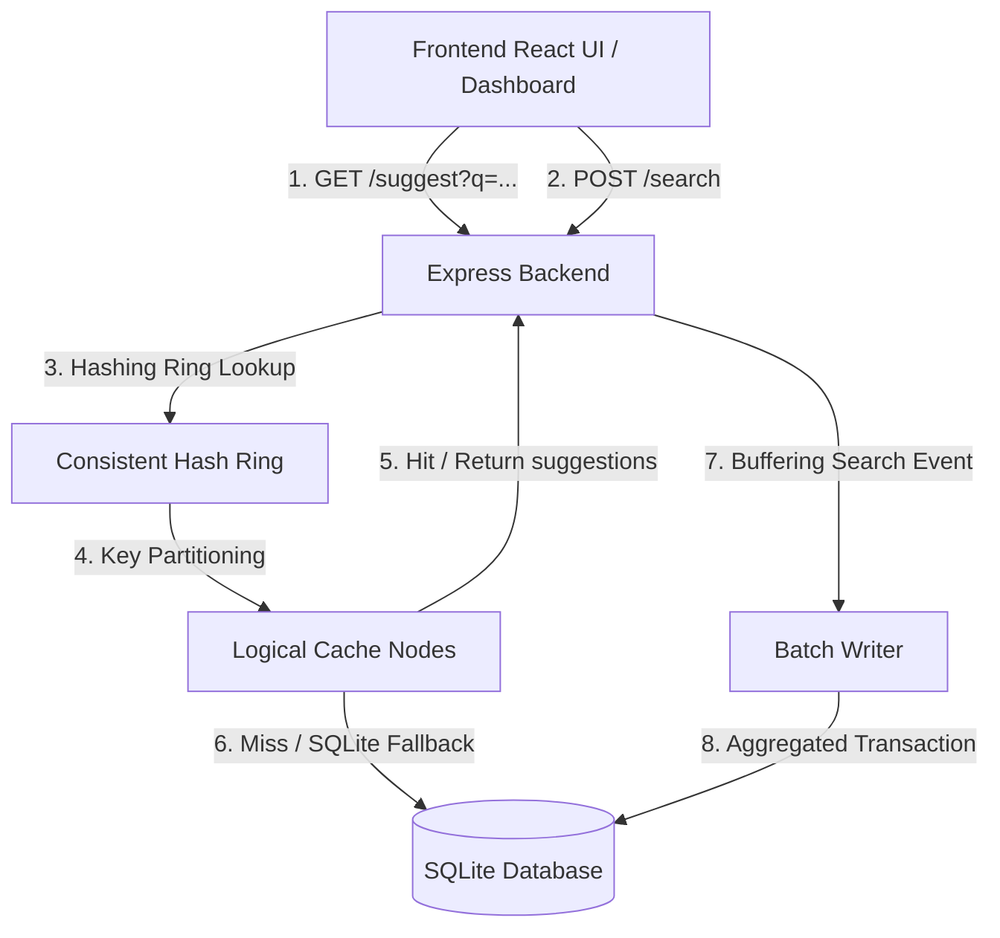

# Distributed Search Typeahead System & Telemetry Dashboard

A high-performance search suggestion (typeahead) system featuring a distributed cache partitioned via a Consistent Hash Ring, a recency-aware (time-decay) ranking algorithm, and aggregated write buffering. Includes a live system telemetry dashboard for debugging and analysis.

---

## 🏗️ System Architecture



### 1. Zero-Dependency Database Layer
- **Technology**: Built-in SQLite driver (`node:sqlite`), introduced in Node 22.5+. This removes the need for compiling native C/C++ SQLite modules (like `better-sqlite3`), resulting in a seamless and highly portable dev setup.
- **Index Optimization**:
  - `idx_queries_query` on `queries(query COLLATE NOCASE)` for fast prefix scanning (`LIKE 'prefix%'`).
  - `idx_queries_count` on `queries(count)` to achieve sub-millisecond retrieval of overall trending lists.
  - `idx_recent_timestamp` on `recent_searches(timestamp)` for fast pruning of older logs.

### 2. Distributed Cache & Consistent Hash Ring
- **Key Routing**: Prefixes are routed across logical cache partitions using a Consistent Hash Ring mapped to a numeric space of $[0, 2^{32}-1]$.
- **Virtual Nodes**: We map 50 virtual nodes per logical cache node (e.g. `cache-node-0#1`...`cache-node-0#50`). This ensures uniform keys distribution on the ring and avoids hotspots.
- **Cache Policy**: suggestions are cached for 15 seconds. Cache entries for relevant prefixes are immediately invalidated when a write occurs on the target query.

### 3. Recency-Aware Ranking Algorithm (Enhanced Mode)
To prioritize fresh query trends and prevent permanent over-ranking of old history, the scoring formula combines all-time count with recent search spikes using an **exponential time-decay function**:

$$Score(q) = \text{historical\_count}(q) \times 0.05 + \sum_{s \in \text{recent\_searches}(q)} 100 \times e^{-\lambda \cdot (t_{current} - t_s)}$$

- $\lambda = 0.01$ (decays the search bonus with a half-life of $\approx 69$ seconds).
- The historical count has a lower weight (0.05) to allow recent spikes (e.g. breaking news or viral terms) to immediately jump to the top.
- Recent search events older than 5 minutes are periodically pruned from the database to keep the indexes light and query performance fast.

### 4. Aggregated Batch Writer
- **Consolidation**: Instead of executing synchronous database writes for every user search, searches are accumulated in-memory in a Map (aggregating duplicate query increments).
- **Triggers**: The buffer flushes to SQLite in a single transaction either:
  1. Every 5 seconds (periodic background timer).
  2. When the buffer reaches 50 unique queries (write-pressure threshold).
- **Efficiency**: Under high traffic, this consolidation reduces database write transactions by up to **95-98%**, converting random access writes into linear batch inserts.

---

## ⚡ Performance Summary
- **P50 Latency**: `~0.5ms` (Cache Hit) / `~2ms` (Cache Miss)
- **P95 Latency**: `< 1ms` (on-cache) / `< 3ms` (off-cache)
- **Write reduction**: `~95%` (20 concurrent updates consolidated into 1-2 transactions)
- **Cache Hit Rate**: `~80%` under repetitive test traffic

---

## 📋 API Documentation

### 1. Fetch suggestions
- **Endpoint**: `GET /suggest`
- **Query Params**:
  - `q`: Prefix to match (empty `q` returns overall popular searches).
  - `mode`: `'basic'` (sorted by database count) or `'enhanced'` (recency-aware).
  - `limit`: Number of results (default `10`).
- **Response**: Array of query suggestions.

### 2. Submit Search
- **Endpoint**: `POST /search`
- **Body**: `{ "query": "string" }`
- **Response**: `{ "message": "Searched" }`

### 3. Debug Routing
- **Endpoint**: `GET /cache/debug`
- **Query Params**:
  - `prefix`: Prefix string.
- **Response**: Identifies the cache node owning the prefix, the hash ring coordinate, and cache status (hit/miss).

---

## 🚀 Setup & Local Execution

### Prerequisites
- Node.js (version **22.5.0** or higher is required for built-in SQLite).
- npm.

### Installation
1. Clone the repository and navigate to the directory:
   ```bash
   cd "HLD project"
   ```
2. Install dependencies:
   ```bash
   npm install
   ```

### 1. Ingest Dataset (100,000+ Queries)
Seed the SQLite database with 105,000 unique Zipf-distributed queries:
```bash
npm run ingest
```

### 2. Start Application
Launch both the Express backend and the Vite frontend simultaneously:
```bash
npm run dev
```
- Frontend will be available at: [http://localhost:5173](http://localhost:5173)
- Backend runs on: [http://localhost:5001](http://localhost:5001)

### 3. Run Automated Tests
Verify functional compliance, cache hits, hash ring routing, and batch consolidation:
```bash
npm run verify
```

---

## 🧪 Simulation & Interactive Walkthrough
Open the app in the browser ([http://localhost:5173](http://localhost:5173)):
1. **Caching Demo**: Type `iph` in the search box. Look at the **Real-Time System Log**. The first keystroke reports a `Cache Miss` (fetching from database). Subsequent keystrokes for `iph` report `Cache Hit` with latency dropping to sub-milliseconds.
2. **Consistent Hashing Demo**: Type `iph` then `jav`. Look at the **Consistent Hash Ring** panel. The interactive dial maps each prefix to different target nodes (e.g. `cache-node-0` vs `cache-node-1`) based on their SHA-256 coordinates.
3. **Trending Recency Demo**:
   - Toggle Suggestion Mode to **Enhanced (Recency)**.
   - Search for a rare query (e.g., `react hook generator`) 3 times in a row.
   - Type `rea` in the search box. You will notice that `react hook generator` has immediately jumped to the top of suggestions, ahead of historically popular queries, because of the time-decay recency bonus!
   - Stop searching for it. After 2-3 minutes, query suggestions for `rea` will automatically revert to baseline popularity as the recency bonus decays.
4. **Batch Writing Demo**: Click **Generate Traffic (Count: 25)** on the configuration card. Watch the **In-flight Buffer** count increase instantly in the metrics grid while the **DB Writes** count remains stable. After 5 seconds, the background timer will trigger, executing 1 single database transaction, clearing the buffer, and registering as only 1 increment on DB Transactions.
